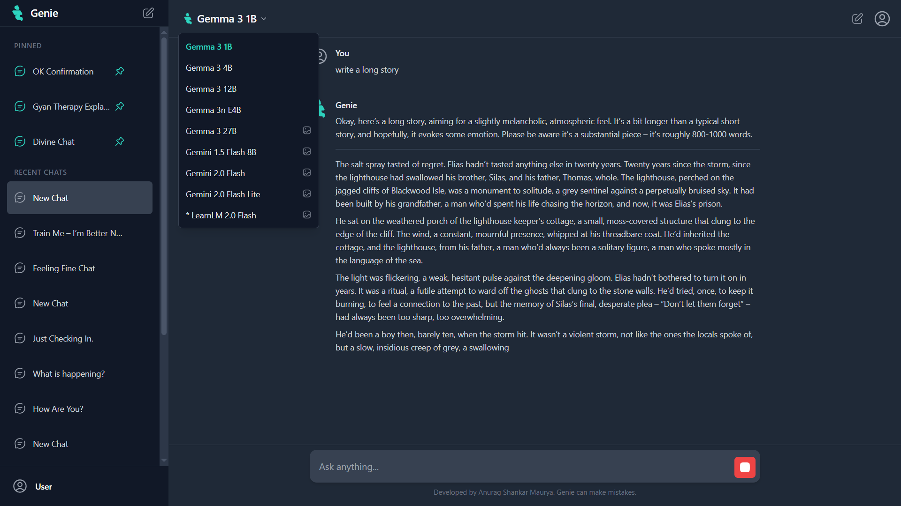
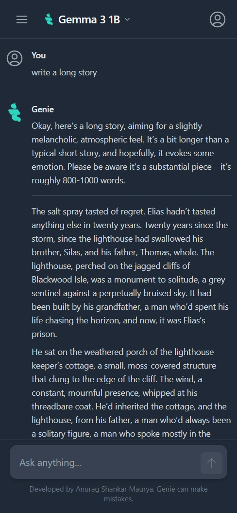
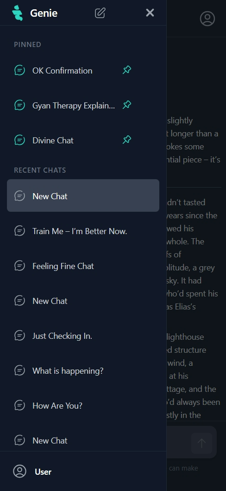

# <a href="https://raw.githubusercontent.com/Anurag-Shankar-Maurya/Genie-Ai/7bf99a86b5fa5e9e164ef5f117283e0b04491729/geine_favicon.svg"></a>Genie Ai

Genie Ai is a modern, interactive chat application powered by Google's Gemini AI models. It allows users to engage in text-based conversations and, with supported models, include images in their prompts for a rich, multimodal experience.

<p align="center">



</p>

## 🚀 Live Demo

Check out the live version of Genie Ai here: [genieaichatbot.netlify.app](https://genieaichatbot.netlify.app/)

## ✨ Features

- **Interactive Chat Interface:** Smooth and responsive user experience for seamless conversations.
- **Multiple AI Models:** Supports various Google Gemini & Gemma models, allowing users to choose based on their needs.
- **Multimodal Conversations:** Upload one or more images (JPG, PNG, WebP) to include in your prompts with image-supporting models.
- **Markdown Rendering:** AI responses are rendered with Markdown for better readability, including code blocks, lists, and more.
- **Stop Message Generation:** Users can interrupt the AI if it's taking too long or the response is not as expected.
- **Persistent Chat Sessions:** Chat history is saved in the browser's `localStorage`, so you can pick up where you left off.
- **Chat Management:**
  - Create new chat sessions.
  - Switch between different conversations.
  - Pin important chats for quick access.
  - Delete unwanted chat sessions.
  - Automatic chat title generation based on the initial prompt.
- **Model Selection:** Easily switch between different AI models for each chat session.
- **Responsive Design:** Works well on various screen sizes.

## 🛠️ Tech Stack

- **Frontend:** React, TypeScript
- **Styling:** Tailwind CSS
- **AI Integration:** Google Generative AI SDK (`@google/genai`)
- **Build Tool:** Vite
- **Markdown Parsing:** Marked.js

## 🚀 Getting Started

Follow these instructions to get a copy of the project up and running on your local machine for development and testing purposes.

### Prerequisites

- Node.js (v18.x or later recommended)
- npm or yarn
- A Google Gemini API Key. You can obtain one from Google AI Studio.

### Installation

1. **Clone the repository:**

   ```bash
   git clone https://github.com/Anurag-Shankar-Maurya/Genie-Ai.git
   cd Genie-Ai
   ```

2. **Install dependencies:**
   Using npm:

   ```bash
   npm install
   ```

   Or using yarn:

   ```bash
   yarn install
   ```

3. **Set up environment variables:**
   Create a `.env.local` file in the root of your project directory. You can do this by copying the example file if one exists, or creating it from scratch:

   ```bash
   cp .env.example .env.local  # If .env.example exists
   # OR create .env.local manually
   ```

   Add your Google Gemini API key to the `.env.local` file:

   ```env
   GEMINI_API_KEY=YOUR_GEMINI_API_KEY_HERE
   ```

   Replace `YOUR_GEMINI_API_KEY_HERE` with your actual API key.

### Running the Application

1. **Start the development server:**
   Using npm:

   ```bash
   npm run dev
   ```

   Or using yarn:

   ```bash
   yarn dev
   ```

2. Open your browser and navigate to `http://localhost:5173` (or the port specified in your Vite config/console output).

## ⚙️ Configuration

- **Models:** The available AI models are configured in `src/constants.ts`. You can update this list if new models become available or if you want to change the default model.
- **API Key:** Managed via the `.env.local` file as described in the installation steps.

## 🤝 Contributing

Contributions are welcome! If you have suggestions for improvements or new features, feel free to:

1. Fork the Project
2. Create your Feature Branch (`git checkout -b feature/AmazingFeature`)
3. Commit your Changes (`git commit -m 'Add some AmazingFeature'`)
4. Push to the Branch (`git push origin feature/AmazingFeature`)
5. Open a Pull Request

## 🧑‍💻 Author & Contact

**Anurag Shankar Maurya**

- **Email:** <anuragshankarmaurya@gmail.com>
- Instagram: [@anuragshankarmaurya](https://www.instagram.com/anuragshankarmaurya/)  
- LinkedIn: [Anurag Shankar Maurya](https://www.linkedin.com/in/anurag-shankar-maurya/)  
- GitHub: [Anurag-Shankar-Maurya](https://github.com/Anurag-Shankar-Maurya) 
